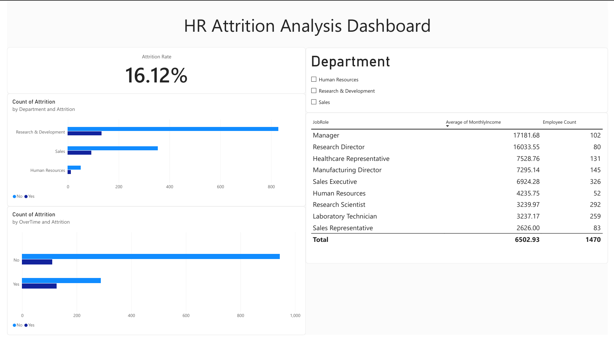

# HR Attrition Analysis

SQL and Power BI analysis of employee attrition drivers using the IBM HR Analytics dataset — identifying which factors (department, overtime, job role, income) most strongly predict employee turnover.

## Objective
Identify which factors are most associated with employee attrition, to inform retention strategy.

## Tools
SQL (SQLite via DB Browser), Power BI Desktop (DAX measures, interactive dashboard)

## Dashboard Preview

The dashboard includes a company-wide attrition rate KPI, department and overtime breakdowns, a job-role detail table, and a department filter for interactive exploration.

## Key Findings

1. **Overall attrition rate is 16.12%** — roughly 1 in 6 employees leaves. This is the baseline every other breakdown is compared against.

2. **Sales has the highest departmental attrition at 20.63%**, followed by HR at 19.05% — both above the company average. R&D is notably lower at 13.84%, suggesting stronger retention practices there.

3. **Overtime is the strongest single attrition driver found**: employees working overtime leave at 30.53%, nearly 3x the rate of those who don't (10.44%) — a larger effect than department alone.

4. **Sales Representatives leave the fastest**, averaging just 2.09 years of tenure before departing — the shortest of any role — suggesting an early-tenure retention issue specific to this role. Laboratory Technicians have the highest raw count of departures (62 people).

5. **Employees who left earned ~30% less on average** ($4,787/month vs $6,833/month) than those who stayed.

**Overall narrative:** Attrition is concentrated among lower-paid, high-overtime roles like Sales Representative, who tend to leave within the first 2-3 years — pointing to a retention risk tied to compensation and workload rather than a company-wide problem.

## Files in this repo
- `hr_attrition_queries.sql` — all 5 SQL queries used for the analysis
- `hr_attrition_dashboard.pbix` — Power BI dashboard file
- `dashboard_screenshot.png` — static preview of the dashboard

## Dataset
[IBM HR Analytics Employee Attrition & Performance](https://www.kaggle.com/datasets/pavansubhasht/ibm-hr-analytics-attrition-dataset) (Kaggle)
